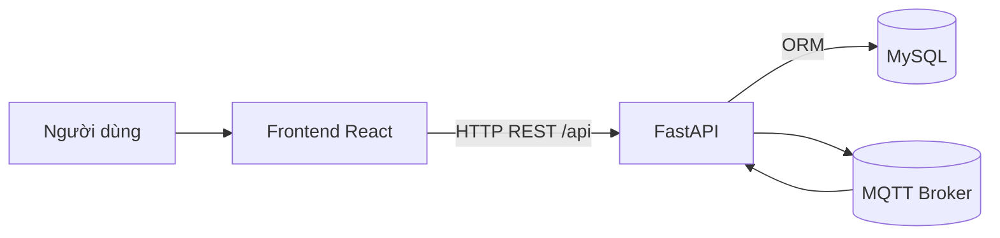

# Tài Liệu Kiến Trúc Hệ Thống

- **Mã tài liệu**: ARCH-IOT-001
- **Phiên bản**: 1.0.0
- **Ngày cập nhật**: 2026-04-04

## 1. Mục tiêu kiến trúc

- Tách bạch frontend và backend theo mô hình client-server.
- Đảm bảo bảo mật truy cập API bằng JWT và RBAC.
- Cho phép tích hợp dữ liệu thiết bị theo thời gian thực qua MQTT.
- Tạo nền tảng dễ bảo trì và mở rộng.

## 2. Kiến trúc mức cao

## 3. Thành phần chính

### 3.1 Frontend
- Vị trí mã nguồn: `src/`
- Vai trò:
  - Điều hướng người dùng.
  - Quản lý trạng thái đăng nhập (AuthContext).
  - Hiển thị dữ liệu dashboard, thiết bị, user management.
  - Gọi API backend qua `apiFetch`.

### 3.2 Backend
- Vị trí mã nguồn: `backend/app/`
- Vai trò:
  - Cung cấp REST API cho xác thực, user, device, authorization.
  - Quản lý nghiệp vụ phân quyền và trạng thái user.
  - Kết nối DB.
  - Khởi tạo và giám sát MQTT subscriber.

### 3.3 Cơ sở dữ liệu
- Hệ quản trị: MySQL.
- Bảng chính:
  - `user`
  - `device`
  - `device_authorization`

### 3.4 Tích hợp MQTT
- Subscriber khởi tạo trong lifecycle backend.
- Lưu tạm message gần nhất bằng buffer trong bộ nhớ.
- Cung cấp API quan sát trạng thái và message.

## 4. Luồng hệ thống trọng yếu

### 4.1 Luồng đăng nhập
1. Frontend gửi `POST /api/auth/login`.
2. Backend xác thực user + mật khẩu hash.
3. Backend trả JWT và user profile.
4. Frontend lưu JWT và dùng cho các request sau.

### 4.2 Luồng phân quyền truy cập thiết bị
1. User gọi danh sách thiết bị của mình.
2. Backend join `device_authorization` + kiểm tra hạn.
3. Trả về thiết bị còn hiệu lực.

### 4.3 Luồng khởi động backend
1. Chờ DB sẵn sàng.
2. Tạo/đồng bộ schema cơ bản.
3. Chạy patch migration nhẹ.
4. Seed dữ liệu mặc định.
5. Khởi chạy MQTT subscriber.

## 5. Quan điểm triển khai

- Frontend và backend triển khai độc lập.
- CORS cho phép frontend gọi backend theo cấu hình.
- Secrets cấu hình qua biến môi trường.
- Khuyến nghị bổ sung reverse proxy và TLS ở môi trường production.

## 6. Rủi ro kỹ thuật và hướng xử lý

- **Rủi ro**: Frontend dự kiến có WS realtime nhưng backend chưa mở WS endpoint.
  - **Hướng xử lý**: Bổ sung WebSocket gateway hoặc SSE trong backend.
- **Rủi ro**: Một số màn hình còn phụ thuộc mock data fallback.
  - **Hướng xử lý**: Chuẩn hóa toàn bộ luồng sang API thật.
